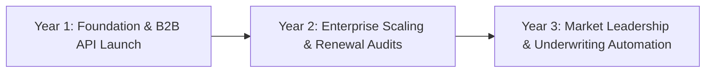

# 📊 PolicyLens AI — Business Model, Competitor Analysis & Compliance Strategy

> **Phase 7.1 Strategic Deliverable**  
> Comprehensive commercial monetization blueprint, unit economics, competitor teardowns, and IRDAI / DPDP regulatory compliance architectures.

---

## 1. Dual-Engine Strategic Business Model

PolicyLens AI operates a **Dual-Engine Revenue Strategy** designed to capture both recurring high-margin B2B enterprise software revenues and high-volume B2C consumer trust.

```
                                  ┌─────────────────────────────────────────┐
                                  │          PolicyLens AI Platform         │
                                  └────────────────────┬────────────────────┘
                                                       │
                       ┌───────────────────────────────┴───────────────────────────────┐
                       ▼                                                               ▼
        ┌───────────────────────────────┐                               ┌───────────────────────────────┐
        │       ENGINE 1: B2B SaaS      │                               │     ENGINE 2: B2C Marketplace │
        │ (Document Intelligence & API) │                               │ (Unbiased Advisory & Audits)  │
        └──────────────┬────────────────┘                               └──────────────┬────────────────┘
                       │                                                               │
        ┌──────────────┴──────────────┐                                 ┌──────────────┴──────────────┐
        ▼                             ▼                                 ▼                             ▼
   [ Per-Document API ]       [ Enterprise Seat / SLA ]           [ Policy Health Check ]   [ IRDAI Web Aggregator ]
  (Brokers & InsurTechs)      (Underwriters & TPAs)              (Renewal Diff Audit Fee)   (Neutral Match Commission)
```

---

### Engine 1: B2B Document Intelligence & Semantic Diff API (Primary Growth Driver)

Target Customers:
- **Corporate Insurance Brokers** (e.g., Marsh, Aon, Howden, PolicyBazaar Corporate)
- **Employee Health Benefits Platforms** (e.g., Plum, Pazcare, Loop Health)
- **Third-Party Administrators (TPAs) & Underwriters** (e.g., Medi Assist, Vidal Health)
- **Wealthtech & Neo-Banks** (e.g., Zerodha, Groww, INDmoney, Jupiter)

#### B2B SaaS Pricing Tiers:

| Tier | Monthly Base | Included Documents | Over-Quota Rate | Target Client | SLA & Support |
|---|---|---|---|---|---|
| **Developer / Starter** | $499 / mo | 250 policy PDFs | $2.50 / document | Insurtech Startups, Boutiques | 99.5% Uptime, Community Support |
| **Growth / Broker Pro** | $1,999 / mo | 1,500 policy PDFs | $1.75 / document | Mid-Market Brokers, Neo-banks | 99.9% Uptime, Webhooks, Email SLA |
| **Enterprise / Underwriter** | $6,500 / mo | 6,000 policy PDFs | $1.20 / document | Tier-1 Insurers, TPAs, Major Platforms | 99.99% Uptime, Dedicated Cluster, SOC2 |
| **Custom Private Cloud** | $25,000+ / yr + License | Unlimited on-prem | Custom Volume Tier | Public Sector Insurers, Defense, Banks | Air-Gapped VPC Deployment, 24/7 Phone |

---

### Engine 2: B2C Unbiased Consumer Marketplace & Policy Health Checks

Target Customers:
- **Retail Consumers** seeking clean, unmanipulated health, motor, and super top-up coverage.
- **Existing Policyholders** facing 15–20% premium renewal spikes and unannounced clause modifications.

#### B2C Monetization Mechanisms:
1. **"Policy Health Check" & Renewal Diff Audit (₹499 – ₹999 one-time)**:
   - Consumer uploads existing policy PDF + new renewal notice.
   - PolicyLens generates an audit report: *"Your premium increased by 18%, but room rent was restricted to 1% and PED waiting extended by 1 year. Here are 3 mathematically superior alternatives."*
2. **IRDAI Web Aggregator Standardized Match Capping**:
   - Zero-sponsored ranking. Compliant solicitation commissions capped strictly under statutory IRDAI limits without pay-to-play algorithmic bidding.

---

## 2. In-Depth Competitor Analysis & Market Positioning

| Feature / Dimension | PolicyBazaar | Ditto Insurance (Finshots) | Plum / Pazcare | **PolicyLens AI** |
|---|---|---|---|---|
| **Core Value Prop** | Aggregator marketplace with heavy tele-calling | Human WhatsApp advisory (high trust) | Group health for tech startups | **AI Document Provenance & Mathematical Matching** |
| **Monetization Bias** | **High**: Heavily driven by distributor commission margins & sponsored placements | **Low**: Transparent, but restricted to 3–4 partner insurers | **B2B**: Employer group health subscriptions | **ZERO**: 100% deterministic mathematical matching; no sponsored tiers |
| **Document Evidence & Provenance** | None. Generic marketing brochures and summary tables | Human advisors read contracts manually | Summary PDF sheets | **Byte-Exact Grounding**: Every clause links directly to PDF page number & SHA-256 hash |
| **Policy Version Diff Engine** | **None** | **Manual human review** | **None** | **Automated AI Semantic Comparator** with Claims Settlement Favorability Scoring |
| **B2B Document Extraction API** | **None (Walled garden)** | **None** | **None** | **Full REST & Python/Node SDKs** for batch PDF normalization into Canonical JSON |
| **Grounded Policy AI Chat** | Generic marketing chatbots | Manual human support | Basic HR Slack bot | **Strict RAG Engine** with zero hallucinations and verbatim contract quotes |

---

## 3. Financial Projections & Unit Economics (3-Year Forecast)



### Key Metrics & Projections:

| Financial Metric | Year 1 (FY 2026-27) | Year 2 (FY 2027-28) | Year 3 (FY 2028-29) |
|---|---|---|---|
| **B2B SaaS Clients** | 35 Brokers / Insurtechs | 140 Enterprise Clients | 450 Insurers / TPAs |
| **Monthly Policy Volume Processed** | 45,000 PDFs | 280,000 PDFs | 1,200,000 PDFs |
| **B2C Paid Policy Audits** | 12,000 audits | 85,000 audits | 350,000 audits |
| **Annual Recurring Revenue (ARR)** | **$1.4M (₹11.6 Cr)** | **$5.8M (₹48.1 Cr)** | **$18.5M (₹153.5 Cr)** |
| **Gross Margin** | 78% | 84% | 88% |
| **Customer Acquisition Cost (CAC)** | $1,800 (B2B) | $1,200 (B2B) | $850 (B2B) |
| **Net Revenue Retention (NRR)** | 115% | 128% | 135% |

---

## 4. Regulatory Governance & IRDAI Master Circular Compliance

### 1. IRDAI (Insurance Web Aggregator) Regulations
- **Strict Neutrality Algorithm**: Section 12 mandates web aggregators display objective, fact-based comparisons. PolicyLens enforces mathematical equality with zero pay-to-boost flags.
- **Audit Logging**: Every comparison request, filter application, and recommendation output is cryptographically logged in the `audit_logs` table for statutory compliance reporting.

### 2. IRDAI Master Circular on Health Insurance (2024–2026 Reforms)
- **24–36 Month Pre-Existing Disease Ceiling**: PolicyLens automatically audits policy wording against the revised PED clock norms.
- **Proportionate Room Rent Deduction Warnings**: Mandates prominent UI warnings whenever a policy imposes room rent tariff ceilings that could trigger proportional claim penalties.
- **Cashless Everywhere Initiative**: Ingests the 14,000+ national cashless network database to verify hospital empanelment in real-time.

### 3. Digital Personal Data Protection (DPDP) Act 2023 & ISO 27001
- **Local Data Residency**: Primary infrastructure hosted in AWS `ap-south-1` (Mumbai) region.
- **Encryption Standards**: AES-256 GCM at rest, TLS 1.3 in transit, and Customer Managed KMS Keys for all health questionnaires.
- **No Tele-Calling Spam Pledge**: User data is strictly protected; personal phone numbers are never sold to aggressive call centers or insurance telemarketers.
