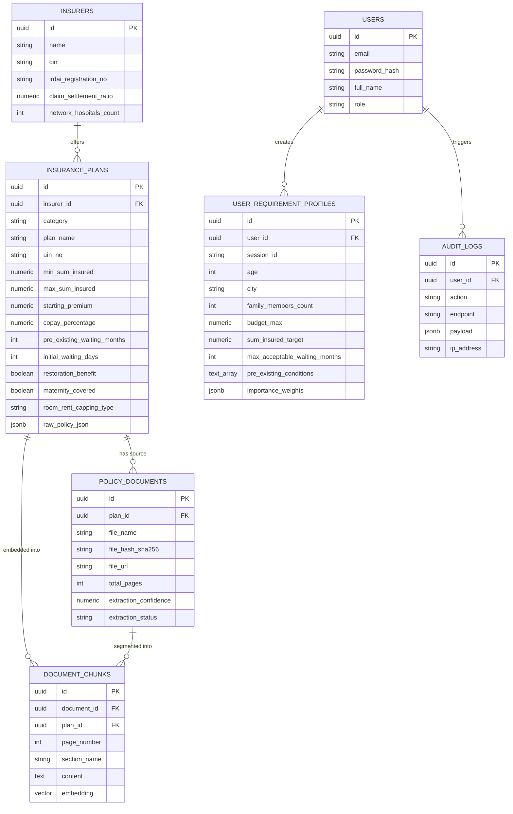

# Entity Relationship (ER) Diagram

Below is the database entity relationship model designed for transparent policy comparisons, AI document provenance, and regulatory audit compliance.

```mermaid
erDiagram
    INSURERS ||--o{ INSURANCE_PLANS : "offers"
    INSURANCE_PLANS ||--o{ POLICY_DOCUMENTS : "has source"
    INSURANCE_PLANS ||--o{ DOCUMENT_CHUNKS : "embedded into"
    POLICY_DOCUMENTS ||--o{ DOCUMENT_CHUNKS : "segmented into"
    USERS ||--o{ USER_REQUIREMENT_PROFILES : "creates"
    USERS ||--o{ AUDIT_LOGS : "triggers"

    INSURERS {
        uuid id PK
        string name
        string cin
        string irdai_registration_no
        numeric claim_settlement_ratio
        int network_hospitals_count
    }

    INSURANCE_PLANS {
        uuid id PK
        uuid insurer_id FK
        string category
        string plan_name
        string uin_no
        numeric min_sum_insured
        numeric max_sum_insured
        numeric starting_premium
        numeric copay_percentage
        int pre_existing_waiting_months
        int initial_waiting_days
        boolean restoration_benefit
        boolean maternity_covered
        string room_rent_capping_type
        jsonb raw_policy_json
    }

    POLICY_DOCUMENTS {
        uuid id PK
        uuid plan_id FK
        string file_name
        string file_hash_sha256
        string file_url
        int total_pages
        numeric extraction_confidence
        string extraction_status
    }

    DOCUMENT_CHUNKS {
        uuid id PK
        uuid document_id FK
        uuid plan_id FK
        int page_number
        string section_name
        text content
        vector embedding
    }

    USERS {
        uuid id PK
        string email
        string password_hash
        string full_name
        string role
    }

    USER_REQUIREMENT_PROFILES {
        uuid id PK
        uuid user_id FK
        string session_id
        int age
        string city
        int family_members_count
        numeric budget_max
        numeric sum_insured_target
        int max_acceptable_waiting_months
        text_array pre_existing_conditions
        jsonb importance_weights
    }

    AUDIT_LOGS {
        uuid id PK
        uuid user_id FK
        string action
        string endpoint
        jsonb payload
        string ip_address
    }
```
