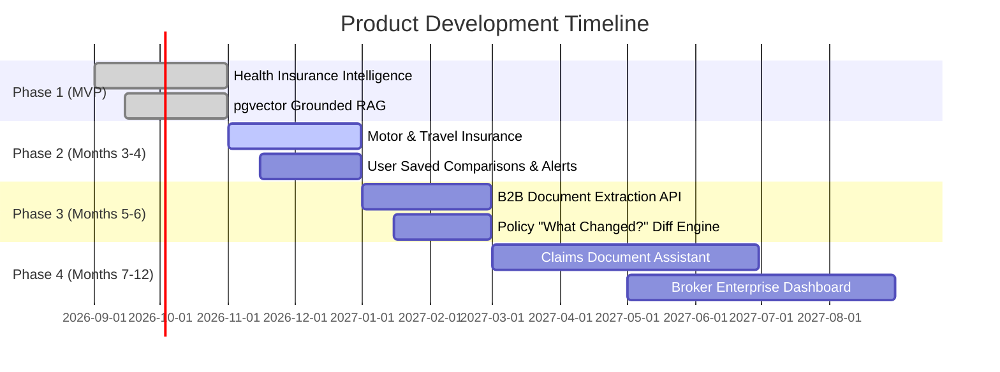

# Pitch Deck & Product Roadmap

## 1. 10-Slide Investor Pitch Deck Structure

1. **The Problem**: Insurance policies in India are 70-page legalese documents that confuse 95% of consumers and leave them with denied claims.
2. **The Opportunity**: Massive growing retail health insurance market in India seeking transparency.
3. **The Solution**: PolicyLens AI — The AI Insurance Intelligence Platform turning complicated PDFs into verifiable, unbiased facts.
4. **Product Demo**: Interactive Fit Analysis and Grounded Policy Assistant with page citations.
5. **Technology & Moat**: Proprietary structured ontology, pgvector RAG pipeline, and document provenance engine.
6. **Regulatory Compliance**: Built natively compliant with IRDAI unbiased web aggregator norms.
7. **Business Model**: Dual-engine strategy (B2C consumer search + B2B Enterprise Document Intelligence API).
8. **Go-To-Market**: SEO-driven policy diff teardowns, broker partnerships, and employer wellness benefits integrations.
9. **Team**: Domain expertise across AI engineering, insurance underwriting, and full-stack security.
10. **The Ask**: Seed funding to scale insurer document ingestion and IRDAI compliance licensing.

---

## 2. Post-MVP 12-Month Product Roadmap

