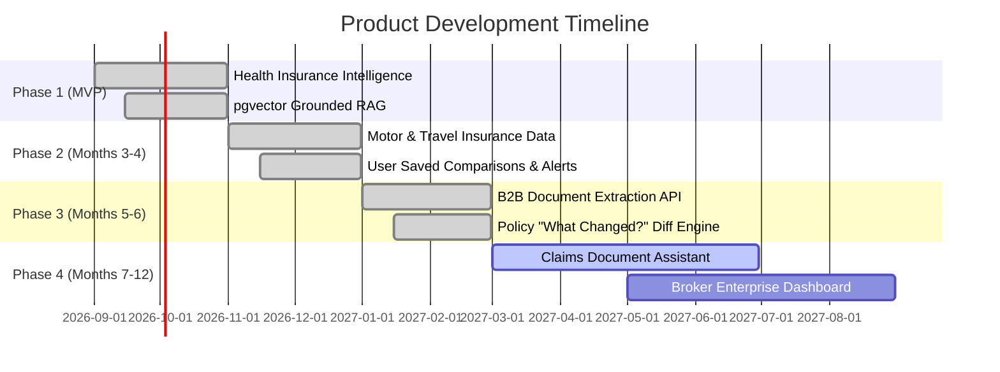

# Pitch Deck & Product Roadmap

## 1. 10-Slide Investor Pitch Deck Structure

1. **The Problem**: Insurance policies in India are 70-page legalese documents that confuse 95% of consumers and leave them with denied claims.
2. **The Opportunity**: Massive growing retail health insurance market in India seeking transparency and API automation.
3. **The Solution**: PolicyLens AI — The AI Insurance Intelligence Platform turning complicated PDFs into verifiable, unbiased facts.
4. **Product Demo**: Interactive Fit Analysis, Policy "What Changed?" Diff Engine, and Grounded Policy Assistant with page citations.
5. **Technology & Moat**: Proprietary structured ontology, pgvector RAG pipeline, document provenance engine, and enterprise B2B batch document parser.
6. **Regulatory Compliance**: Built natively compliant with IRDAI unbiased web aggregator norms and 2026 consumer protection circulars.
7. **Business Model**: Dual-engine strategy (B2C consumer search + B2B Enterprise Document Intelligence API).
8. **Go-To-Market**: SEO-driven policy diff teardowns, broker partnerships, and employer wellness benefits integrations.
9. **Team**: Domain expertise across AI engineering, insurance underwriting, and full-stack security.
10. **The Ask**: Seed funding to scale insurer document ingestion and IRDAI compliance licensing.

---

## 2. 12-Month Product Roadmap Progress

---

## 3. Phase 3 Architecture Deliverables

- **Semantic Policy Diff Engine (`PolicyDiffEngine`)**:
  - Automatically identifies clause-level modifications across policy editions (e.g. 2024 vs 2026).
  - Classifies modifications into `FAVORABLE`, `RESTRICTIVE`, and `NEUTRAL`.
  - Calculates the **Claims Settlement Favorability Score** (0–100) indicating whether contract updates ease claim approvals or introduce restrictions.
  - Page-provenance citation linking across old and new policy documents.

- **B2B Enterprise Document Intelligence API**:
  - API Key authentication and multi-tenant batch document processing.
  - Endpoints: `POST /api/v1/b2b/extract-batch` & `GET /b2b/jobs/:jobId`.
  - Structured extraction conforming to Canonical Insurance Policy JSON Schema with field confidence scores.
  - Webhook delivery and SDK code snippets for cURL, Python (`requests`), and Node.js (`axios`).
