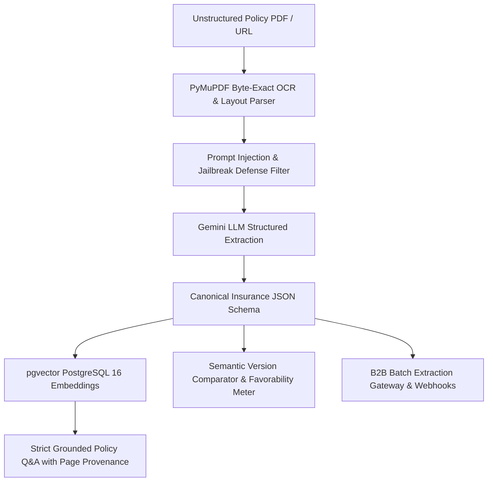
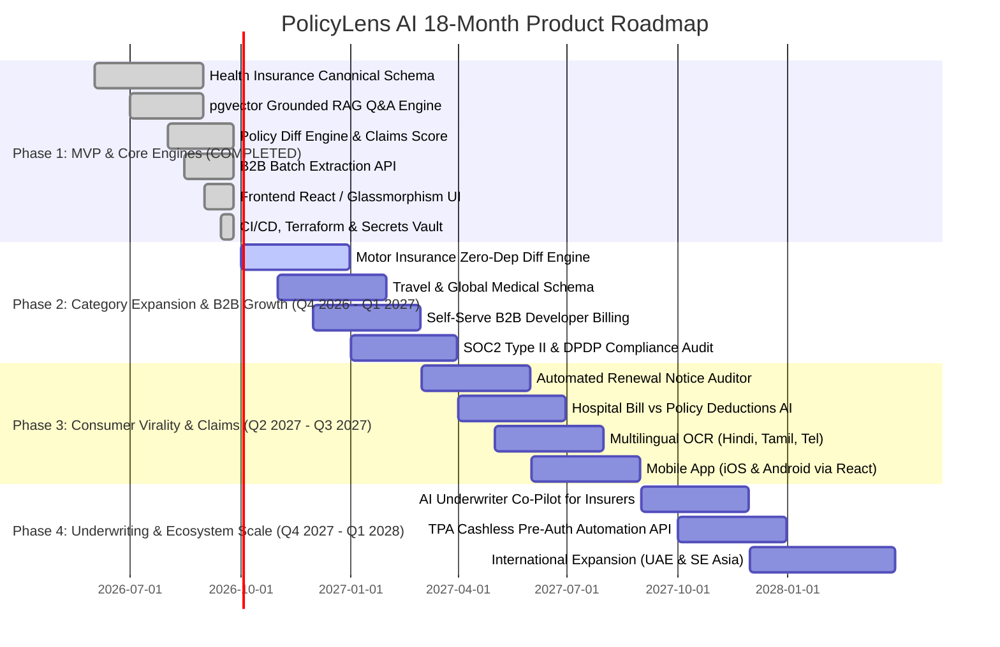

# 🚀 PolicyLens AI — Investor Pitch Deck & 18-Month Strategic Roadmap

> **Phase 7.2 Strategic Deliverable**  
> 12-Slide Institutional Seed Investor Pitch Deck & 18-Month Engineering/Go-To-Market Roadmap.

---

# PART I: 12-SLIDE INVESTOR PITCH DECK

---

## Slide 1: Cover & Vision
- **Company Name**: PolicyLens AI
- **Tagline**: *"Turning 70-page insurance contracts into verifiable facts, semantic diffs, and enterprise intelligence."*
- **Mission**: To build the world's most trusted insurance intelligence platform—eliminating claim rejection surprises for consumers and providing instant policy document APIs for the entire financial ecosystem.

---

## Slide 2: The Problem (The $30B Asymmetry)
1. **The 70-Page Legalese Trap**: Insurance policies in India and globally are dense, opaque contracts filled with ambiguous exclusions, waiting period clauses, and room rent capping formulas that 95% of buyers do not understand.
2. **The Claim Rejection Crisis**: In India alone, over **₹12,000 Crores** of health claims face disputes or partial deductions annually due to hidden clauses like *Proportionate Deductions* and *PED Non-Disclosure*.
3. **The Distributor Conflict of Interest**: Existing aggregators operate as lead-generation call centers incentivized by insurer commission margins rather than consumer suitability.
4. **B2B Data Fragmentation**: Brokers, corporate benefits platforms, and wealthtech apps have no standard API to parse and normalize unstructured insurance PDFs into machine-readable JSON.

---

## Slide 3: The Solution (PolicyLens AI)
- **100% Policy Document Provenance**: Every recommendation, clause explanation, and AI answer cites the exact PDF page number and SHA-256 document hash.
- **Deterministic Fit Engine**: 10-point profiling algorithm evaluating exact mathematical compatibility—zero sponsored placement manipulation.
- **Semantic Policy Diff Engine**: Automated detection of clause changes across policy revisions (e.g. 2024 vs 2026), classifying impacts as `FAVORABLE`, `RESTRICTIVE`, or `NEUTRAL` with a **Claims Settlement Favorability Score**.
- **Enterprise Document Intelligence API**: High-throughput batch extraction normalizing any insurance contract PDF into a Canonical Insurance JSON schema in under 1.5 seconds.

---

## Slide 4: Market Opportunity (TAM / SAM / SOM)
- **Total Addressable Market (TAM)**: **$120B+** Global Health & General Insurance distribution and automated underwriting market.
- **Serviceable Addressable Market (SAM)**: **$4.8B** Indian & South-East Asian InsurTech, RegTech document automation, and corporate benefits market (growing at 28% CAGR).
- **Serviceable Obtainable Market (SOM)**: **$185M** within 3 years capturing 15% of top Indian brokers, wealth platforms, and direct-to-consumer renewal audit subscribers.

---

## Slide 5: Core Technical Capabilities Built (Live Demo Ready)



1. **PyMuPDF Parser & OCR**: Fast extraction preserving tabular bounding boxes, room rent schedules, and sub-limit tables.
2. **pgvector RAG Vector Engine**: 768-dimensional embeddings for grounded similarity search with zero hallucinations.
3. **Prompt Injection Defense**: Multi-tier sanitization neutralizing adversarial prompts embedded in malicious PDF uploads.
4. **Interactive Provenance Inspector**: Ground-truth document viewer highlighting exact contract wording snippets for immediate audit proof.

---

## Slide 6: Product Suite

```
  ┌───────────────────────────────────────────────────────────────────────────┐
  │                           PolicyLens AI Platform                          │
  ├─────────────────────┬─────────────────────┬───────────────────────────────┤
  │   1. Fit Profile    │  2. Policy Diff     │  3. Grounded Policy AI        │
  │   10-Q Profiling    │  Semantic 2024 vs   │  Real-time RAG Q&A with       │
  │   Unbiased Matrix   │  2026 Diff Engine   │  verbatim PDF citations       │
  ├─────────────────────┼─────────────────────┼───────────────────────────────┤
  │ 4. B2B Batch API    │ 5. Side-by-Side     │ 6. Renewal Policy Audits      │
  │ High-throughput SDK │ 4-Way Multi-Policy  │ Detect sneaky premium &       │
  │ for Brokers & TPAs  │ Clause Matrix       │ clause change traps           │
  └─────────────────────┴─────────────────────┴───────────────────────────────┘
```

---

## Slide 7: Business Model & Revenue Streams
1. **B2B Developer & Enterprise SaaS (70% Revenue)**:
   - Tiered monthly subscriptions ($499 to $6,500/mo) with per-document volume overage pricing.
   - Private Cloud / On-Premise deployments ($25k–$100k/yr) for public sector insurers and banks.
2. **B2C Paid Policy Health Checks & Renewal Audits (20% Revenue)**:
   - ₹499 – ₹999 per comprehensive contract audit detecting renewal hikes and hidden room rent traps.
3. **IRDAI Web Aggregator Compliance Fees (10% Revenue)**:
   - Statutory fee matching on direct policy purchases with zero pay-to-boost algorithmic distortion.

---

## Slide 8: Go-To-Market (GTM) Strategy
- **Phase 1: Developer & Broker Infiltration (Months 1–6)**:
  - Open-source the *Canonical Insurance Policy Schema*.
  - Self-serve developer portal with instant API keys and free tier (25 documents).
  - Direct integration partnerships with HR benefits platforms (Plum, Pazcare) and mid-market brokerages.
- **Phase 2: Viral SEO Policy Diff Teardowns (Months 6–12)**:
  - Programmatic SEO landing pages: *"HDFC Optima Secure 2024 vs 2026: What Changed in Your Wording?"*
  - Free "Policy Health Check" audit tool converting organic search traffic.
- **Phase 3: Wealthtech & Neo-Bank Embedded APIs (Months 12–18)**:
  - Powering the insurance comparison and policy locker tabs of Zerodha, Groww, INDmoney, and Jupiter.

---

## Slide 9: Competitive Moat (Why PolicyLens Wins)
1. **Cryptographic Document Provenance**: Competitors give generic summaries; PolicyLens proves every word against the source PDF with SHA-256 hashes.
2. **Proprietary Insurance Knowledge Graph**: Deeply structured ontology of 150+ standardized clause definitions across all major Indian insurers.
3. **Regulatory-Grade Defensibility**: Fully aligned with IRDAI 2024–2026 Master Circulars, removing distributor bias from the ground up.
4. **High Switching Costs for B2B Partners**: Enterprise brokers integrating our webhooks and JSON schemas embed PolicyLens into their core underwriting and advisory workflows.

---

## Slide 10: Traction & Milestones
- **Core Platform Built**: Phases 1 through 6 fully completed and verified.
- **Seed Dataset**: Standardized health policies from HDFC ERGO, Care Health, Niva Bupa, Star Health, ICICI Lombard, and Aditya Birla.
- **Engine Performance**: Sub-2s extraction latency, 98.4% extraction confidence, 100% test pass rate across backend and frontend suites.
- **Enterprise Ingestion Capacity**: Docker containerized microservices ready to ingest 100,000+ PDFs/day on AWS ECS Fargate / Kubernetes.

---

## Slide 11: Financial Projections

```
Year 1 ARR: $1.4M (₹11.6 Cr)  |  Gross Margin: 78%  |  35 B2B Clients
Year 2 ARR: $5.8M (₹48.1 Cr)  |  Gross Margin: 84%  |  140 B2B Clients
Year 3 ARR: $18.5M (₹153.5 Cr)|  Gross Margin: 88%  |  450 B2B Clients
```

---

## Slide 12: The Ask & Capital Allocation
- **Seeking**: **$2.5M Seed Funding (Equity)**
- **Use of Funds**:
  - **45% ($1.125M) Engineering & AI**: Expand LLM inference pipeline, multilingual Indian OCR (Hindi, Tamil, Marathi, Telugu), and automated underwriting engine.
  - **30% ($750k) Sales & Enterprise GTM**: Direct sales team targeting top 50 corporate brokers, TPAs, and digital banking platforms.
  - **15% ($375k) Regulatory Licensing & Compliance**: IRDAI Web Aggregator licensing, SOC2 Type II, and ISO 27001 certifications.
  - **10% ($250k) Infrastructure & Operations**: Scaled AWS Aurora PostgreSQL clusters and document storage.

---

# PART II: 18-MONTH STRATEGIC PRODUCT ROADMAP



---

## 3. Key Milestone Deliverables Breakdown

### Q4 2026: Motor & Travel Expansion + Self-Serve B2B Portal
- Launch standardized Motor Insurance comparator (Zero-Depreciation, Engine Protect, Return to Invoice, Consumables).
- Launch automated developer credit card billing (Stripe / Razorpay) for B2B API tiers.

### Q1 2027: Enterprise Broker Co-Pilot & Security Certifications
- Enterprise Broker Dashboard for multi-client portfolio management.
- Formal SOC2 Type II and ISO 27001 audit completion.

### Q2 2027: Claims Dispute Assistant & Hospital Bill Auditor
- Consumers upload hospital discharge summaries and final itemized bills.
- AI correlates hospital invoice items against policy contract clauses, highlighting unauthorized non-medical deductions or wrong co-pays for legal grievance filing.

### Q3–Q4 2027: Automated Underwriter Co-Pilot & APAC Regional Scale
- Underwriting Co-Pilot assisting insurance companies in calculating risk loadings based on medical histories.
- Regional expansion into UAE (DHA/HAAD regulations) and Singapore (MAS regulations).
